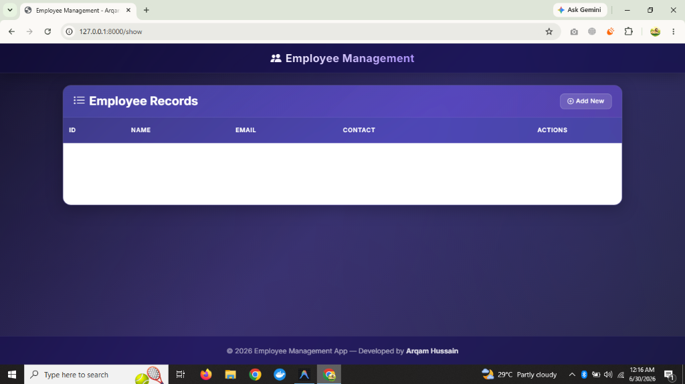

# Employee Management System


[](https://www.youtube.com/watch?v=i_Z8_e0N6OI)

A full-featured **Employee Management CRUD Application** built with Django and styled with a modern **Glassmorphism** UI. Create, read, update, and delete employee records with ease.

🎥 **[Watch Video Tutorial](https://www.youtube.com/watch?v=i_Z8_e0N6OI)**

---

## Features

- **Create** — Add new employees with ID, name, email, and contact
- **Read** — View all employee records in a sortable table
- **Update** — Edit existing employee details
- **Delete** — Remove employee records with confirmation
- **Glassmorphism UI** — Modern frosted-glass design with smooth animations
- **Responsive** — Fully mobile-friendly layout
- **Admin Panel** — Django admin interface available at `/admin/`

## Tech Stack

| Layer  | Technology |
|--------|------------|
| Backend | Django 3.x+ |
| Frontend | Bootstrap 5.3 + Custom CSS |
| Database | SQLite3 (default) / MySQL |
| Design | Glassmorphism (backdrop-filter, rgba layering) |
| Static Files | WhiteNoise |
| WSGI Server | Gunicorn |

## Screenshots

### Employee Records Dashboard


## Installation

### Prerequisites

- Python 3.8+
- pip

### Setup

```bash
# Clone the repository
git clone https://github.com/yourusername/Django-crud-application.git
cd Django-crud-application

# Create a virtual environment
python -m venv .venv

# Activate the virtual environment
# Windows (PowerShell):
.venv\Scripts\Activate.ps1
# Windows (CMD):
.venv\Scripts\activate.bat
# macOS/Linux:
source .venv/bin/activate

# Install dependencies
pip install -r requirements.txt

# Run migrations
python manage.py migrate

# Start the development server
python manage.py runserver
```

Open [http://127.0.0.1:8000](http://127.0.0.1:8000) in your browser.

### MySQL (optional)

Edit `settings.py` to use MySQL instead of SQLite3:

```python
DATABASES = {
    'default': {
        'ENGINE': 'django.db.backends.mysql',
        'NAME': 'your_db_name',
        'USER': 'your_user',
        'PASSWORD': 'your_password',
        'HOST': 'localhost',
        'PORT': '3306',
    }
}
```

## Project Structure

```
Django-crud-application/
├── manage.py                     # Django CLI entry point
├── requirements.txt              # Python dependencies
├── static/
│   └── css/
│       └── style.css             # Glassmorphism custom styles
├── templates/
│   └── base.html                 # Base template (navbar, footer)
├── DjangoJavaTpointCRUD/         # Project settings & root URLconf
│   ├── settings.py
│   ├── urls.py
│   └── wsgi.py
└── employee/                     # Main CRUD app
    ├── models.py                 # Employee model
    ├── views.py                  # CRUD view functions
    ├── forms.py                  # ModelForm for Employee
    ├── urls.py                   # App URL routing
    └── templates/
        ├── home.html             # Dashboard visualization template
        ├── index.html            # Create employee form
        ├── show.html             # Employee list table
        ├── edit.html             # Update employee form
        └── confirm_delete.html   # Delete confirmation screen
```

## API Endpoints

| URL | Method | Description |
|-----|--------|-------------|
| `/` | GET | Redirect to employee list |
| `/show` | GET | View all employees |
| `/emp` | GET | Display add-employee form |
| `/emp` | POST | Create a new employee |
| `/edit/<id>` | GET | Display edit form |
| `/update/<id>` | POST | Update employee record |
| `/delete/<id>` | GET | Delete employee record |
| `/admin/` | GET | Django admin panel |

## Usage

1. Navigate to **`/show`** to see all employees
2. Click **Add New** to create an employee record
3. Click **Edit** to modify an existing record
4. Click **Delete** to remove a record (with confirmation)

## Development

```bash
# Collect static files
python manage.py collectstatic

# Create superuser for admin panel
python manage.py createsuperuser

# Make migrations after model changes
python manage.py makemigrations
python manage.py migrate
```

## License

Distributed under the MIT License. See `LICENSE` for more information.

---

<p align="center">
  Built with ❤️ by <strong>Arqam Hussain</strong>
</p>
