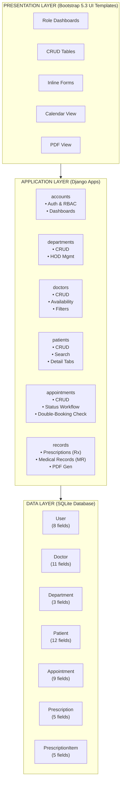
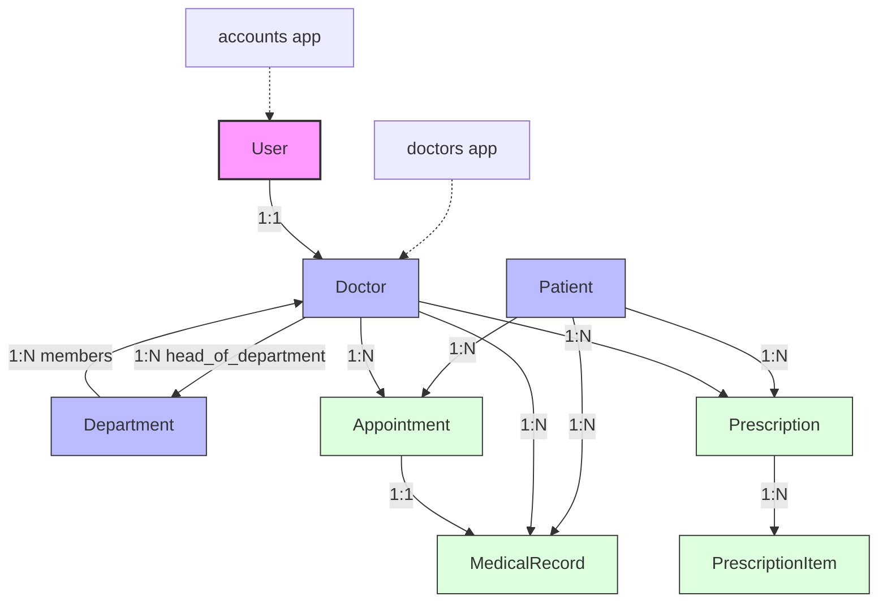
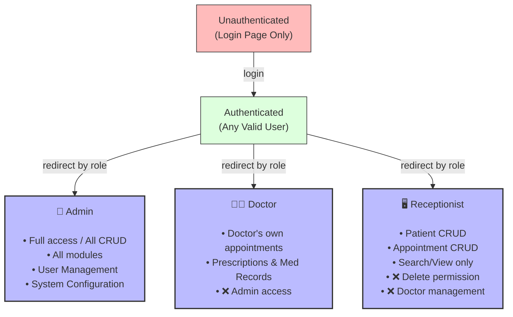
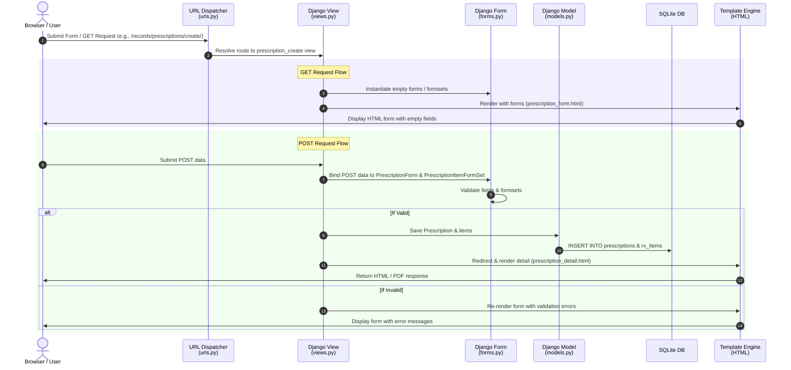
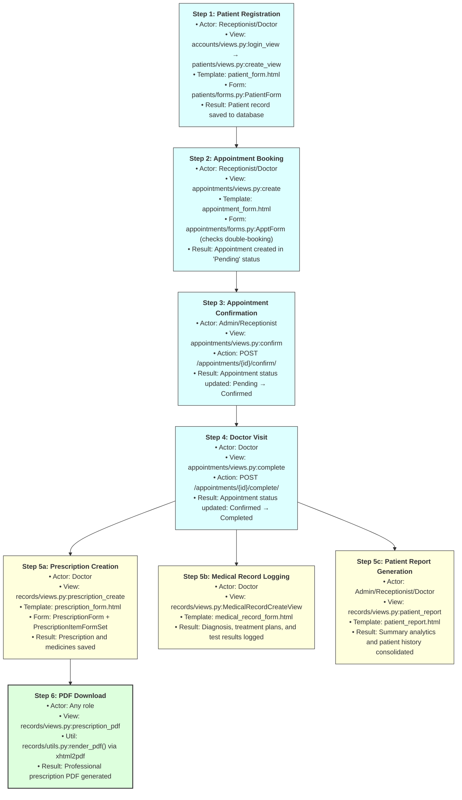

<div align="center">
  <h1>🏥 Hospital Management System</h1>
  <p>A full-featured Django web application for managing hospital operations with role-based access control, appointment scheduling, prescription management, and digital medical records.</p>

  <p>
    <a href="https://www.python.org/downloads/release/python-3129/">
      
    </a>
    <a href="https://docs.djangoproject.com/en/6.0/releases/6.0.6/">
      
    </a>
    <a href="https://www.sqlite.org/">
      
    </a>
    <a href="https://getbootstrap.com/docs/5.3/">
      
    </a>
    <a href="https://xhtml2pdf.readthedocs.io/">
      
    </a>
    <br>
    <a href="LICENSE">
      
    </a>
    
    
  </p>
  <p>
    <a href="Hospital_Management_System.pdf" target="_blank" rel="noopener noreferrer"><strong>📄 Open Hospital_Management_System.pdf (Project Report)</strong></a>
  </p>
</div>

---

## 📋 Table of Contents

- [Target Audience](#-target-audience)
- [System Architecture](#-system-architecture)
- [Request Data Flow](#-request-data-flow-mvt-pattern)
- [End-to-End Patient Journey](#-end-to-end-patient-journey)
- [Architecture & Design Decisions](#-architecture--design-decisions)
- [Modules Reference](#-modules-reference)
  - [Accounts & Authentication](#accounts--authentication)
  - [Departments](#departments-module)
  - [Doctors](#doctors-module)
  - [Patients](#patients-module)
  - [Appointments](#appointments-module)
  - [Medical Records & Prescriptions](#medical-records--prescriptions)
- [API Routes](#-api-routes)
- [Testing](#-testing)
- [Management Commands](#-management-commands)
- [Deployment](#-deployment)
- [Contributing](#-contributing)
- [License](#-license)

---

## 🎯 Target Audience

This system is designed for the following user groups in a hospital or clinical setting:

| Persona | Role in System | Primary Goals |
|---------|---------------|--------------|
| **🏥 Hospital Administrator** | `Admin` | Oversee all operations — manage departments, doctors, staff accounts; view system-wide analytics; ensure data integrity across all modules |
| **👨‍⚕️ Doctor / Physician** | `Doctor` | View daily appointment schedule; record diagnoses, prescriptions, and medical notes; access patient history; manage availability calendar |
| **🖥️ Receptionist / Front Desk** | `Receptionist` | Register new patients; book, reschedule, and cancel appointments; manage front-desk scheduling; view today's patient queue |
| **🧑‍💼 IT / System Admin** | `Admin` | Configure system settings; manage user accounts and role assignments; monitor system health through Django Admin panel |

---

## 🏗 System Architecture

### High-Level Architecture



### Application-to-Model Mapping



### User Role Hierarchy & Access Control



---

## ⚡ Request Data Flow (MVT Pattern)

Every user action in the system follows Django's Model-View-Template (MVT) architecture. Below is the complete request lifecycle for a typical operation (e.g., creating a prescription):



This pattern is repeated consistently across all 6 apps, with the following variations:

| App | Primary View Pattern | Distinctive Feature |
|-----|---------------------|-------------------|
| **accounts** | Function-Based Views | Login/logout session management |
| **departments** | Class-Based Views (CRUD) | Admin-only mixin protection |
| **doctors** | Mixed CBV + FBV | Doctor-specific filtered queries |
| **patients** | Class-Based Views (CRUD) | Tabbed detail template |
| **appointments** | Class-Based Views + FBV actions | Status transition endpoints + double-booking `clean()` |
| **records** | Function-Based Views (with inline formsets) | Formset handling + PDF generation |

---

## 🔄 End-to-End Patient Journey

Below is the complete lifecycle of a patient within the system — from first registration to receiving a prescription — showing exactly which modules, views, and templates are involved at each step.



### End-to-End Scenario Walkthrough

| Step | Action | Actor | Module | Key Files |
|------|--------|-------|--------|-----------|
| 1 | Patient walks in → Receptionist registers them | Receptionist | Patients | `patients/views.py`, `patient_form.html` |
| 2 | Receptionist schedules a doctor appointment | Receptionist | Appointments | `appointments/views.py`, `appointment_form.html` |
| 3 | Admin confirms the appointment | Admin | Appointments | `appointments/views.py:confirm` |
| 4 | Doctor marks appointment as Completed | Doctor | Appointments | `appointments/views.py:complete` |
| 5a | Doctor creates prescription with medicines | Doctor | Records | `records/views.py`, `prescription_form.html`, `PrescriptionItemFormSet` |
| 5b | Doctor logs medical record (diagnosis + treatment) | Doctor | Records | `records/views.py`, `medical_record_form.html` |
| 6 | Staff downloads prescription PDF | Any | Records | `records/utils.py`, `prescription_pdf.html` |

---

## 🏗 Architecture & Design Decisions

### Key Design Patterns

| Decision | Implementation | Rationale |
|----------|---------------|-----------|
| **Custom User Model** | `AUTH_USER_MODEL = 'accounts.User'` with `role` field (CharField) | Established before first migration to avoid complex database migration; enables role checks directly on the user object without additional queries |
| **Role-Based Access Control** | `AdminRequiredMixin` (two variants: `UserPassesTestMixin` and `LoginRequiredMixin`) + template-level `user.role` checks | Separates authorization logic at both view and template layers; prevents unauthorized URL access and hides restricted UI elements |
| **Delete Strategy** | `CASCADE` for tightly-dependent children (e.g., `PrescriptionItem → Prescription`); `SET_NULL` for records that should survive parent deletion (e.g., `Appointment → Doctor`) | Balances data integrity with graceful degradation when referenced entities are removed |
| **Circular Reference** | `Department.head_of_department` FK added in a separate migration (`0002`) after `Doctor` model exists | Django cannot create circular FKs in a single migration; deferred migration resolves this cleanly |
| **Inline Formset** | `PrescriptionItemFormSet` using `inlineformset_factory` with `extra=3` and `can_delete=True` | Enables dynamic addition and removal of multiple medicine items on a single prescription form |
| **Comma-Separated Days** | `Doctor.available_days` stored as a CharField; split via custom `record_extras.py:split` template filter | Keeps the model schema simple for a list-based field that doesn't require relational queries |
| **PDF Generation** | Dedicated `prescription_pdf.html` template rendered via `xhtml2pdf` through `records/utils.py:render_pdf()` | Separates PDF layout from screen layout; enables professional print formatting with letterhead and signatures |
| **Email Backend** | Console email backend (`django.core.mail.backends.console.EmailBackend`) during development | Outputs emails to the console for easy debugging; swap to SMTP in production |

### Model Relationship Map

```
User (1:1) → Doctor
Doctor (N:1) → Department
Department (1:N) → Doctor (as head_of_department)
Patient (1:N) → Appointment
Patient (1:N) → MedicalRecord
Patient (1:N) → Prescription
Doctor (1:N) → Appointment
Doctor (1:N) → Prescription
Doctor (1:N) → MedicalRecord
Appointment (1:N) → Prescription
Appointment (1:1) ↔ MedicalRecord
Prescription (1:N) → PrescriptionItem
```

---

## 📚 Modules Reference

### Accounts & Authentication

- **User Model**: Extends Django's `AbstractUser` with a `role` field (`Admin`, `Doctor`, `Receptionist`) and `phone_number`
- **Authentication**: Custom `login_view` with support for `next` parameter redirection; `logout_view` via Django's `LogoutView`
- **Dashboard Routing**: After login, users are redirected to role-specific dashboards that display relevant KPIs and quick actions
- **Admin Dashboard**: Aggregated statistics — total patients, total doctors, today's appointments, pending appointments
- **Doctor Dashboard**: Personal stats — today's appointments, total appointments assigned, unique patient count
- **Receptionist Dashboard**: Front-desk view — today's full schedule, total patients in system, pending appointments with quick action buttons

### Departments Module

- **Access**: Full CRUD restricted to Admin role only
- **Head of Department**: FK relationship to Doctor; resolved after Doctor model exists (migration `0002`)
- **Listing**: Sorted alphabetically; paginated at 20 per page
- **Validation**: Department names are unique

### Doctors Module

- **Access**: Admin can perform all CRUD; all authenticated users can view listing and details
- **Profile Fields**: User account linkage, department, specialization, qualifications, experience, consultation fee, weekly availability (days + time range), active status
- **Filtering**: By department, specialization, and text search on name/specialization
- **Doctor-Specific Views**: Filtered to the logged-in doctor's profile — appointments, prescriptions, medical records
- **Calendar**: Weekly grid view showing availability for all active doctors, with fee badges and book-action links

### Patients Module

- **Access**: All authenticated users can create, view, update; delete restricted to Admin
- **Registration Fields**: Name, DOB, gender, blood group, phone, email, address, emergency contact
- **Detail Tabs**: Three Bootstrap tab panels — Appointments (full history), Prescriptions, Medical Records — all filtered by the current patient
- **Search**: Across first name, last name, phone number, and patient ID

### Appointments Module

- **Access**: All authenticated users with role-based query filtering (doctors see only their own)
- **Double-Booking Prevention**: Custom `AppointmentForm.clean()` checks for existing appointments with the same doctor on the same date and time
- **Filtering**: By patient name, appointment date, doctor, department, and status
- **Status Actions**: Dedicated URL endpoints for `confirm`, `complete`, and `cancel` transitions

#### Appointment Status Lifecycle

#### Appointment Status Lifecycle

```mermaid
stateDiagram-v2
    [*] --> Pending : Initial booking
    
    state Pending {
        note right of Pending: Actions: confirm or cancel
    }
    
    Pending --> Confirmed : Admin / Receptionist confirms
    Pending --> Cancelled : Cancelled
    
    state Confirmed {
        note right of Confirmed: Actions: complete or cancel
    }
    
    Confirmed --> Completed : Doctor treats patient
    Confirmed --> Cancelled : Cancelled
    
    Completed --> [*] : Medical records & prescriptions logged
    Cancelled --> [*]
```

#### Prescription Creation Flow (Post-Appointment)

#### Prescription Creation Flow (Post-Appointment)

```mermaid
graph LR
    appt[Appointment Completed] -->|triggers| rx[Prescription Created]
    rx -->|contains 1:N| items[Prescription Items<br>(Medicines)]
    rx -->|renders via xhtml2pdf| pdf[PDF Download]

    style appt fill:#f99,stroke:#333,stroke-width:1px
    style rx fill:#fd9,stroke:#333,stroke-width:1px
    style items fill:#dfd,stroke:#333,stroke-width:1px
    style pdf fill:#9f9,stroke:#333,stroke-width:2px
```

### Medical Records & Prescriptions

- **Prescriptions**: Created against completed appointments; includes diagnosis, notes, and multiple medicine items
- **Prescription Items**: Inline formset supports dynamic add/remove; fields include medicine name, dosage, frequency, duration, instructions
- **Medical Records**: Separate from prescriptions; captures diagnosis, treatment plan, and test results per visit
- **PDF Output**: Dedicated `prescription_pdf.html` template rendered via `xhtml2pdf`; includes hospital branding, formatted prescription table, and doctor signature area
- **Patient Reports**: Aggregate report showing total appointments, prescriptions, and medical records per patient

---

## 🧭 API Routes

### Authentication

| Method | URL | View | Access | Description |
|--------|-----|------|--------|-------------|
| GET/POST | `/login/` | `login_view` | Public | Login form |
| GET | `/logout/` | `logout_view` | Authenticated | Logout |

### Dashboards

| Method | URL | View | Access | Description |
|--------|-----|------|--------|-------------|
| GET | `/dashboard/` | `dashboard_redirect` | Authenticated | Redirects to role dashboard |
| GET | `/dashboard/admin/` | `admin_dashboard` | Admin | System-wide statistics |
| GET | `/dashboard/doctor/` | `doctor_dashboard` | Doctor | Personal appointment stats |
| GET | `/dashboard/receptionist/` | `receptionist_dashboard` | Receptionist | Front-desk overview |

### Departments

| Method | URL | View | Access | Description |
|--------|-----|------|--------|-------------|
| GET | `/departments/` | `DepartmentListView` | Any auth | List all departments |
| GET/POST | `/departments/create/` | `DepartmentCreateView` | Admin | Create department |
| GET/POST | `/departments/<id>/update/` | `DepartmentUpdateView` | Admin | Edit department |
| POST | `/departments/<id>/delete/` | `DepartmentDeleteView` | Admin | Delete department |

### Doctors

| Method | URL | View | Access | Description |
|--------|-----|------|--------|-------------|
| GET | `/doctors/` | `DoctorListView` | Any auth | List all doctors |
| GET/POST | `/doctors/create/` | `DoctorCreateView` | Admin | Register doctor |
| GET | `/doctors/<id>/` | `DoctorDetailView` | Any auth | Doctor profile |
| GET/POST | `/doctors/<id>/update/` | `DoctorUpdateView` | Admin | Edit doctor |
| POST | `/doctors/<id>/delete/` | `DoctorDeleteView` | Admin | Delete doctor |
| GET | `/doctors/my/appointments/` | `doctor_appointments_view` | Doctor | My appointments |
| GET | `/doctors/my/prescriptions/` | `doctor_prescriptions_view` | Doctor | My prescriptions |
| GET | `/doctors/my/records/` | `doctor_medical_records_view` | Doctor | My medical records |
| GET | `/doctors/calendar/` | `doctor_calendar` | Any auth | Weekly availability calendar |

### Patients

| Method | URL | View | Access | Description |
|--------|-----|------|--------|-------------|
| GET | `/patients/` | `PatientListView` | Any auth | List all patients |
| GET/POST | `/patients/create/` | `PatientCreateView` | Any auth | Register patient |
| GET | `/patients/<id>/` | `PatientDetailView` | Any auth | Patient profile + tabs |
| GET/POST | `/patients/<id>/update/` | `PatientUpdateView` | Any auth | Edit patient |
| POST | `/patients/<id>/delete/` | `PatientDeleteView` | Admin | Delete patient |

### Appointments

| Method | URL | View | Access | Description |
|--------|-----|------|--------|-------------|
| GET | `/appointments/` | `AppointmentListView` | Any auth | List all appointments |
| GET/POST | `/appointments/create/` | `AppointmentCreateView` | Any auth | Book appointment |
| GET | `/appointments/<id>/` | `AppointmentDetailView` | Any auth | Appointment details |
| GET/POST | `/appointments/<id>/update/` | `AppointmentUpdateView` | Any auth | Edit appointment |
| POST | `/appointments/<id>/delete/` | `AppointmentDeleteView` | Any auth | Delete appointment |
| POST | `/appointments/<id>/confirm/` | `appointment_confirm` | Any auth | Confirm appointment |
| POST | `/appointments/<id>/complete/` | `appointment_complete` | Any auth | Complete appointment |
| POST | `/appointments/<id>/cancel/` | `appointment_cancel` | Any auth | Cancel appointment |

### Records (Prescriptions & Medical Records)

| Method | URL | View | Access | Description |
|--------|-----|------|--------|-------------|
| GET | `/records/prescriptions/` | `PrescriptionListView` | Any auth | List prescriptions |
| GET/POST | `/records/prescriptions/create/` | `prescription_create` | Any auth | Create prescription (inline formset) |
| GET | `/records/prescriptions/<id>/` | `PrescriptionDetailView` | Any auth | Prescription details |
| GET/POST | `/records/prescriptions/<id>/update/` | `prescription_update` | Any auth | Edit prescription |
| GET | `/records/prescriptions/<id>/pdf/` | `prescription_pdf` | Any auth | Download PDF |
| POST | `/records/prescriptions/<id>/delete/` | `PrescriptionDeleteView` | Admin | Delete prescription |
| GET | `/records/records/` | `MedicalRecordListView` | Any auth | List medical records |
| GET/POST | `/records/records/create/` | `MedicalRecordCreateView` | Any auth | Create record |
| GET | `/records/records/<id>/` | `MedicalRecordDetailView` | Any auth | Record details |
| GET/POST | `/records/records/<id>/update/` | `MedicalRecordUpdateView` | Any auth | Edit record |
| POST | `/records/records/<id>/delete/` | `MedicalRecordDeleteView` | Admin | Delete record |
| GET | `/records/patient-report/` | `patient_report` | Any auth | Patient summary report |

### Error Pages

| Status Code | Handler | Description |
|-------------|---------|-------------|
| 404 | `hospital.views.handler404` | Custom "Page Not Found" with navigation |
| 500 | `hospital.views.handler500` | Custom "Server Error" with fallback links |

---

## 🧪 Testing

### End-to-End Tests (Playwright)

An automated Playwright test script is available at `check_all.py`. It covers:

- User login for all three roles
- Role-based navigation and dashboard access
- CRUD operations for all modules
- Appointment status transitions
- Search and filtering functionality
- Custom error page rendering
- Form validation and error states

```bash
# Run the Playwright test suite
python check_all.py
```

> **Note:** Unit tests are stubbed in each app's `tests.py` and ready for implementation. Contributions are welcome.

---

## ⚙️ Management Commands

| Command | Description |
|---------|-------------|
| `python manage.py seed_data` | Seeds the database with demo data (users, departments, doctors, patients, appointments, prescriptions, medical records). Idempotent — safe to re-run. |
| `python manage.py send_reminders` | Sends email reminders for tomorrow's confirmed/pending appointments. Use `--dry-run` to preview without sending. |

---

## 🌐 Deployment

The project includes a `Procfile` for deployment on platforms supporting Gunicorn:

```
web: gunicorn hospital.wsgi --log-file -
```

### Production Considerations

1. **Set `DEBUG = False`** in `settings.py`
2. **Configure `ALLOWED_HOSTS`** with your domain
3. **Switch to a production email backend** (e.g., SMTP with SendGrid, Mailgun)
4. **Use a production-grade database** (PostgreSQL recommended; update `DATABASES` in settings)
5. **Serve static files** via a CDN or web server (e.g., WhiteNoise, Nginx)
6. **Rotate the `SECRET_KEY`** to a secure, environment-specific value
7. **Set up HTTPS** with a reverse proxy (Nginx + Let's Encrypt)

---

## 🤝 Contributing

Contributions are welcome! Please follow these steps:

1. Fork the repository
2. Create a feature branch (`git checkout -b feature/amazing-feature`)
3. Make your changes
4. Run the Playwright tests to verify functionality (`python check_all.py`)
5. Commit your changes (`git commit -m 'Add amazing feature'`)
6. Push to the branch (`git push origin feature/amazing-feature`)
7. Open a Pull Request

---

## 📄 License

Distributed under the MIT License. See `LICENSE` for more information.

---

<div align="center">
  <sub>Built with ❤️ using Django 6.0 & Bootstrap 5.3</sub>
  <br>
  <sub>© 2026 — Hospital Management System</sub>
</div>